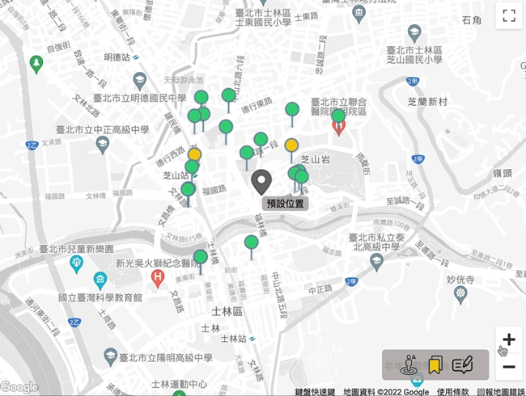

# Release Your Needs

依據台北市政府公廁點位資訊，當使用者定位後，提供使用者搜尋周邊鄰近廁所。  
This application provides preside location of public restrooms based on the sources produced by the Taipei city government.  
🔗 Website URL : https://mymap-896b7.web.app/  
The testing account and testing password : user2@user2.com / user22  

## Frontend Technique
- React Hooks   
  (SPA with functional components)
- React Router  
  ( SPA routing )
 
## Backend Technique
- Cloud Firebase  
  ( managed sources for toilet spots and users login infomation )
- Firebase Storage  
  ( managed images )
- Firebase Authentication   
  ( e-mail , password login / google login )
- Firebase Hosting  
  ( production-grade web content hosting )

## Third Party APIs
- Google Maps JavaScript API  
- Google Maps Place API ( Place Search , Place Details )  
- 政府開放資料平台 － 臺北市公廁點位資訊

## Version Control
- Git / GitHub

## Building tools
- NPM 
- Webpack  
- Babel-Loader
- Prettier 

## Main Features
- 提供使用者，定點搜尋鄰近的公廁點位  
  Enabling users to search for nearby public restrooms.
- 依據營業時間，區分三種顏色地標，快速尋找開放中的場所  
  According to opening hours, with 3 different color markers to quickly look for avaliable locations.
- 撰寫評論功能，描述體驗以提供實用資訊  
  comment writing feature, share experiences and provide useful information. 
- 收藏地點功能，建立專屬清單  
  Save locations. Create private list.
- 支援多種裝置切換  
  Support RWD on different devices

## Contact
Jessie Lin  
📫 e-mail : b19950828@gmail.com