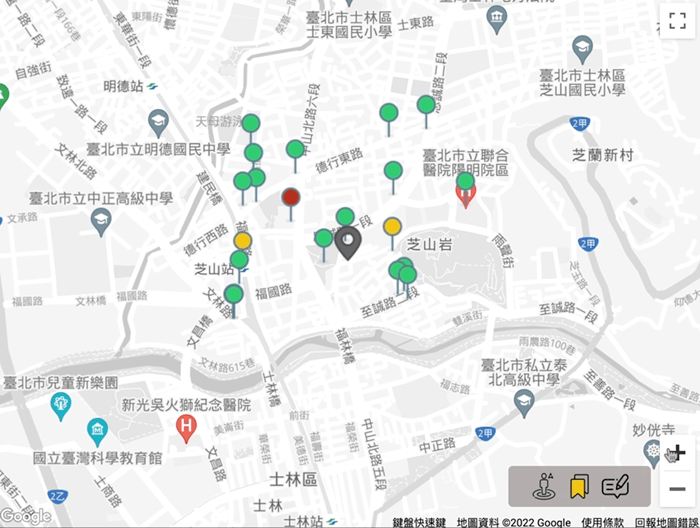

# Release Your Needs

### 專案說明
依據台北市政府公廁點位資訊，在使用者定位後，提供使用者搜尋周邊鄰近廁所。  
🔗 Website URL : https://mymap-896b7.web.app/  
<!--   -->

### Front-End
React Hook  
Webpack  
Babel-Loader
 
### Back-End
Cloud Firebase  
Firebase Authentication  
Firebase Hosting  
Node Package Manager  

### 3rd Party APIs
Google Maps JavaScript API  
Google Maps Place API ( Place Search , Place Details )  
政府開放資料平台 － 臺北市公廁點位資訊

